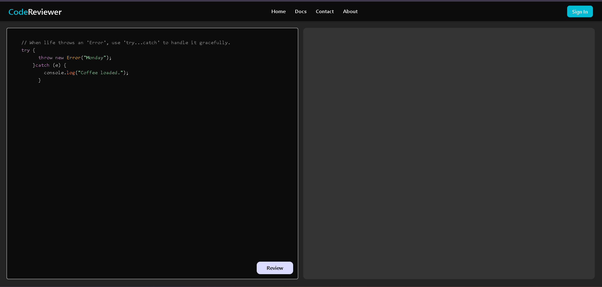

LINK : https://review-mu-eight.vercel.app

💡 Overview
Briefly introduce your project here. What is its main purpose? What problem does it solve? Keep this section engaging—it's the first thing visitors will read!

Example: This is a full-stack web application designed to help users track their daily tasks and boost productivity. Built with modern web technologies, it provides a clean, fast, and intuitive user experience.

✨ Features
List the key capabilities and standout features of your application.

Feature 1: Clear, concise description of the feature.

Feature 2: Another major capability.

Feature 4: Any other notable functionality (e.g., "Responsive design for all devices").

🛠️ Tech Stack
Detail the technologies used to build and run the project.

Category	Technology	Description
Frontend	React.	The primary library/framework for the user interface.
Backend	Node.js
Styling	 CSS

⚙️ Getting Started
Instructions on how to set up and run the project locally for development or testing.

Prerequisites
Ensure you have the following installed:

Node.js (for JavaScript projects)

npm or yarn

Git

Installation
Clone the repository:

Bash

git clone https://github.com/MEHULsahu6/CodeReviewer

cd your-repo-name
Install dependencies for both the client and server (adjust directory names as needed):

Bash

# For the root or specific folder
npm install
# OR
yarn install
Set up Environment Variables:
Create a .env file in the root directory (or respective client/server directories) and add your configurations (e.g., database URI, API keys, secret keys).

# .env 
GEMINI_API_KEY = your api key

Run the application:

Bash

npm start
# OR
npm run dev
🤝 Contributing
We welcome contributions! If you have a suggestion that would make this better, please fork the repo and create a pull request.

Fork the Project.

Create your Feature Branch (git checkout -b feature/AmazingFeature).

Commit your Changes (git commit -m 'Add some AmazingFeature').

Push to the Branch (git push origin feature/AmazingFeature).

Open a Pull Request.

✉️ Contact
Mehul Kumar Sahu - [mehulkumars315@gmail.com]
